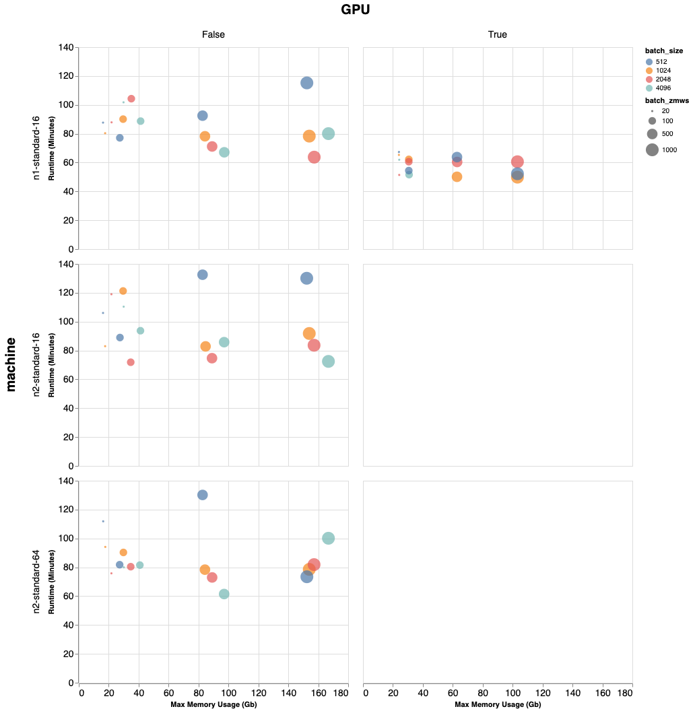

# Runtime on different hardware configurations

## Recommendations

The recommended compute setup for DeepConsensus is to shard each SMRT Cell into
at least 500 shards, each of which can run on a 16-CPU machine (or smaller). We
find that having more than 16 CPUs available for each shard does not
significantly improve runtime. Additionally, running with `--batch_size=1024
--batch_zmws=100` is a reasonable setup for minimizing memory requirements while
still achieving the best runtime. If you find that this exhausts the memory on
your machines though, reducing both, e.g. to `--batch_size=512 --batch_zmws=20`
would be a good thing to try.

See the [yield metrics page](yield_metrics.md) for total runtimes on full SMRT
Cells of different sequencing runs.

## Testing runtime on different hardware configurations

We processed 10,000 ZMWs with `ccs` and `actc`. After filtering, we were left
with 3,577 ZMWs, which we used to profile runtimes using `deepconsensus run`
across several hardware configurations. These estimates only reflect the runtime
required to perform inference, after subread data has been preprocessed.



Runtime, max memory usage, `batch_size`, and `batch_zmws` are shown across
different machine types. We observe that `batch_zmws` has a large impact on
memory usage. Our current implementation requires setting `batch_zmws` and
`batch_size` carefully to achieve optimal performance. We are working to improve
performance further and allow for more predictable runtimes based on
DeepConsensus settings.

We only show GPU runtimes for `n1-standard-16`. Note that we observe job
failures when using GPU with larger `batch_size` (>=4096) and with larger values
of `batch_zmws` (500, 1000).

## Runtime Test Configurations

### `n2-standard-64`: 64vCPUs (Cascade Lake)

This command shows what machine we tested on:

```bash
gcloud compute instances create "${USER}-n2-64" \
  --scopes "compute-rw,storage-full,cloud-platform" \
  --image-family "ubuntu-2004-lts" \
  --image-project "ubuntu-os-cloud" \
  --machine-type "n2-standard-64" \
  --boot-disk-size "200" \
  --zone "us-west1-b"
```

### `n2-standard-16`: 16vCPUs (Cascade Lake)

This command shows what machine we tested on:

```bash
gcloud compute instances create "${USER}-n2-16" \
  --scopes "compute-rw,storage-full,cloud-platform" \
  --image-family "ubuntu-2004-lts" \
  --image-project "ubuntu-os-cloud" \
  --machine-type "n2-standard-16" \
  --boot-disk-size "200" \
  --zone "us-west1-b"
```

### `n1-standard-16`, 16vCPUs

This command shows what machine we tested on:

```bash
gcloud compute instances create "${USER}-gpu" \
  --scopes "compute-rw,storage-full,cloud-platform" \
  --maintenance-policy "TERMINATE" \
  --image-family "ubuntu-2004-lts" \
  --image-project "ubuntu-os-cloud" \
  --machine-type "n1-standard-16" \
  --boot-disk-size "200" \
  --zone "us-west1-b"
```

### `n1-standard-16 + P100 GPU`, 16vCPUs (SkyLake)

This command shows what machine we tested on:

```bash
gcloud compute instances create "${USER}-gpu" \
  --scopes "compute-rw,storage-full,cloud-platform" \
  --maintenance-policy "TERMINATE" \
  --accelerator=type=nvidia-tesla-p100,count=1 \
  --image-family "ubuntu-2004-lts" \
  --image-project "ubuntu-os-cloud" \
  --machine-type "n1-standard-16" \
  --boot-disk-size "200" \
  --zone "us-west1-b" \
  --min-cpu-platform "Intel Skylake"
```

## Test Dataset

The 10k ZMW test dataset is available on Google Storage:

`gs://brain-genomics-public/research/deepconsensus/quickstart/v0.3/n10000.subreads.bam`
